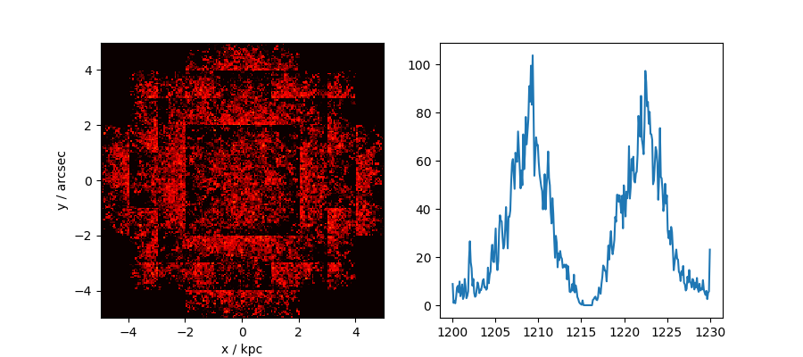
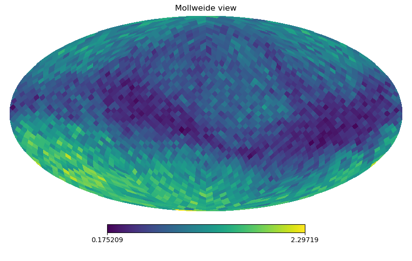

# <span style="font-variant:small-caps;">MoCaLaTA</span>

Lyman &alpha; radiative transfer in galaxies simulated with adaptive mesh refinement.

---

## Intro <a name="intro"></a>
This is the very first attempt at publishing <span style="font-variant:small-caps;">MoCaLaTA</span>, the Ly&alpha; RT code I built during my Ph.D. At the moment, it is mostly meant to be used by collaborators. Hence the lack of documentation. If you find this page and would like to know more, don't hesitate to contact me.

The version of <span style="font-variant:small-caps;">MoCaLaTA</span> is slightly different from my "own" version, but will be updated along the way. It's *serial*, i.e. it isn't parallelized. Written in Fortran 95/2003 in one, big chunk, the idea is that <span style="font-variant:small-caps;">MoCaLaTA</span> should be virtually a plug-and-play code, requiring no installation, `make`'ing or anything beyond compiling (e.g. with [gfortran](https://gcc.gnu.org/wiki/GFortran)).

## Acknowledgments <a name="ackn"></a>

The code is free for anyone to use, copy, modify, distribute, and so on, as desribed in the [License](https://github.com/anisotropela/MoCaLaTA/blob/master/LICENSE). If your work leads to a publication, I'd like you to cite

[Laursen, Razoumov, & Sommer-Larsen (2009, ApJ, 696, 853)](https://iopscience.iop.org/article/10.1088/0004-637X/696/1/853/meta)

where the code is described, tested, and applied. The implementation of dust in the code is described in [Laursen, Sommer-Larsen, & Andersen (2009, ApJ, 704, 1640)](https://iopscience.iop.org/article/10.1088/0004-637X/704/2/1640/meta).

### Previous use <a name="">cites</a>

<span style="font-variant:small-caps;">MoCaLaTA</span> has previously been used in the following publications. If you use it, please let me know and I can put you on the list.

* [Laursen et al. (2019, arXiv:180607392)](http://adsabs.harvard.edu/abs/2018arXiv180607392L)
* [Krogager et al. (2013, MNRAS, 433, 3091)](http://adsabs.harvard.edu/abs/2013MNRAS.433.3091K)
* [Laursen et al. (2013, ApJ, 766, 124)](http://adsabs.harvard.edu/abs/2013ApJ...766..124L)
* [Jensen et al. (2013, MNRAS, 428, 1366)](http://adsabs.harvard.edu/abs/2013MNRAS.428.1366J)
* [Christensen et al. (2012, MNRAS, 427, 1973)](http://adsabs.harvard.edu/abs/2012MNRAS.427.1973C)
* [Noterdaeme et al. (2012, A&A, 540, 63)](http://adsabs.harvard.edu/abs/2012A%26A...540A..63N)
* [Fynbo et al. (2011, MNRAS, 413, 2481)](http://adsabs.harvard.edu/abs/2011MNRAS.413.2481F)
* [Watson & Laursen (2011, A&A, 527, 104)](http://adsabs.harvard.edu/abs/2011A%26A...527A.104W)
* [Laursen et al. (2011, ApJ, 728, 52)](http://adsabs.harvard.edu/abs/2011ApJ...728...52L)
* [Laursen et al. (2009, ApJ, 704, 1640)](http://adsabs.harvard.edu/abs/2009ApJ...704.1640L)

## The code <a name="code"></a>

<span style="font-variant:small-caps;">MoCaLaTA</span> assumes an adaptively refined grid, and is thus best for AMR simulations (or regular grids). If your simulation is SPH, the physical properties of the particles must first be interpolated onto a grid. One way to do this is to use the visualization tool [SPLASH](http://users.monash.edu.au/~dprice/splash/) which can at least interpolate to a regular grid, and possibly also an AMR grid; I'll get back to that.

The AMR format assumed by <span style="font-variant:small-caps;">MoCaLaTA</span> is a  *fully threaded grid*, further described in the documentation for the IGM Ly&alpha; RT code [<span style="font-variant:small-caps;">IGMtransfer</span>](https://dark-cosmology.dk/~pela/IGMtransfer.html). At the moment, I provide a code to convert the output from SPLASH to a (regular) grid readable by <span style="font-variant:small-caps;">MoCaLaTA</span>.

### The name <a name="name"></a>

<span style="font-variant:small-caps;">MoCaLaTA</span> stands for
"**Mo**nte
**Ca**rlo
**L**yman
**a**lpha
**T**ransfer
with
**A**MR", referring to the fact that the Ly&alpha; photons are transferred in an AMR grid using a Monte Carlo scheme.

### The basics <a name="basics"></a>

That is, photons are emitted from *random* locations (with the probability of being emitted from a given location proportional to the Ly&alpha; luminosity in that location) and *random* directions, travel a *random* distance through the interstellar (and intergalactic) medium (given by the optical depth), are absorbed/re-emitted by hydrogen atoms (or dust grains) in *random* directions (given by the phase function), thus scattering stochastically until they either escape or are absorbed by dust.

### The input

In each of the cells of <span style="font-variant:small-caps;">MoCaLaTA</span>'s grid, the following physical parameters are needed

* HI number density
* Temperature
* 3D velocity
* Ly&alpha; luminosity (these data are used for calculating initial positions of photons, but are not stored during runtime)
* Metallicity (optional)
* HII number density (optional)

The metallicity and the HII density are used for calculating the dust density, which is an optional feature of <span style="font-variant:small-caps;">MoCaLaTA</span>.

### The output <a name="output"></a>

The photons that escape form an image and a spectrum of the galaxy. The galaxy may be "observed" simultaneously from six different directions (along the Cartesian axes).

## Quick start <a name="quickstart"></a>

### Compilation <a name="compile"></a>

I usually use the gfortran compiler. For the auxiliary codes, you can just replace the <code>gfortran</code> with `ifort`, if that's your compiler, but for `MoCaLaTA.f90` it's a slightly different syntax. In all cases, I call the executables `*.x`.

Compile auxiliary codes with

```
gfortran -O3 splash2jesper.f90     -o splash2jesper.x
gfortran -O3 buildAMR.f90          -o buildAMR.x
gfortran -O3 initialEmission.f90   -o initialEmission.x
```
<!-- gfortran -O3 mkSPLASHtestgrids.f90 -o mkSPLASHtestgrids.x -->

Compile `MoCaLaTA.f90` with one of the following lines

```
gfortran -O3 -x f95-cpp-input -Ddust -DAMR MoCaLaTA.f90 -o MoCaLaTA.x
ifort -O3 -fpp -Ddust -DAMR MoCaLaTA.f90 -o MoCaLaTA.x
```

### Preparing the input data <a name="prepin"></a>

#### Converting SPLASH output to <span style="font-variant:small-caps;">MoCaLaTA</span> input <a name="splash2moca"></a>

Assuming SPH data interpolated onto a regular grid with SPLASH, each physical parameter is written to a file in the form

```
do k=1,nk
  do j=1,nj
    write(*,*) (dat(i,j,k),i=1,ni)
  enddo
enddo
```

A series of test SPLASH files may be created in a directory `testdir/` using
```
./mkSPLASHtestgrids.x
```

These SPLASH data files are converted to <span style="font-variant:small-caps;">MoCaLaTA</span>-readable format with

```
./splash2jesper.x testS2J.in   # Convert test data to a binary called "Jesper.bin"
```

In the above, `testS2J.in` is an input file containing the size of the computational box, as well as the names of the SPLASH files.

`test.in` is the input file containing all relevant information for the "real" <span style="font-variant:small-caps;">MoCaLaTA</span> run — i.e. in- and output file names, gas and photon parameters, cosmology, etc.

#### Build the grid and calculate photon emission sites <a name="emission"></a>

In order for <span style="font-variant:small-caps;">MoCaLaTA</span> not to spend memory on storing the luminosity data, this is used first to calculate the initial position of all photons, after which the luminosity isn't used. First the grid is built, and then the positions are calculated:

```
./buildAMR.x < test.in        # Build the grid from Jesper.bin, creating "RawData.bin"
./initialEmission.x < test.in # Calculate emission locations, creating "CellData.bin"
```

### Execution <a name="exe"></a>

```
./MoCaLaTA.x test.in
```

(notice that in this case, you shouldn't use the `<` redirector.)

As the code is running, some output is generated along the way. This can be redirected into a log file instead, using `./MoCaLaTA.x test.in > test.log`

## Output

A text file containing information about each escaping photon is generated, along with up to six "IFU" cubes representing an "observation" of the galaxy along the Cartesian axes.

## Analyzing the output

A Python code (under development) is provided. Currently, it can do two things

* generate an image and a spectrum from an IFU cube, and
* shows the anisotropic escape of the photons (using a Mollweide projection)

### Image and spectrum

The IFU cubes are saved in the directory `DataDir`/`SubDir`/, and are called `xm.bin` (for the view along the $x$ axis in the negtive direction), `xp.bin`, etc. The keywords `DataDir` and `SubDir` are set in the input file (`test.in` in the example), where you can also set a keyword `outlabel`, which is appended to the basename of the files, just before the extension `.bin`.

To "observe" the galaxy in the example above from the positive direction of the $x$ axis, do (in Python):

```
>>> import analyzeMoCaLaTA as am
>>> am.showobs('testdir','xp')
```

This should produce something like the following figure



To extract only the spectrum of the pixels inside an circular aperture of radius `r` kpc centered on [`x0`,`y0`] \(also in kpc\), use

```
>>> am.showobs('testdir','xp',ap=[x0,y0,r])
```

### Anisotropic escape

In addition to the IFU cubes, <span style="font-variant:small-caps;">MoCaLaTA</span> also spits out a text file with some information about each photon packet

**WILL WRITE MORE HERE. THE FOLLOWING FIGURE WILL BE PRODUCED**

